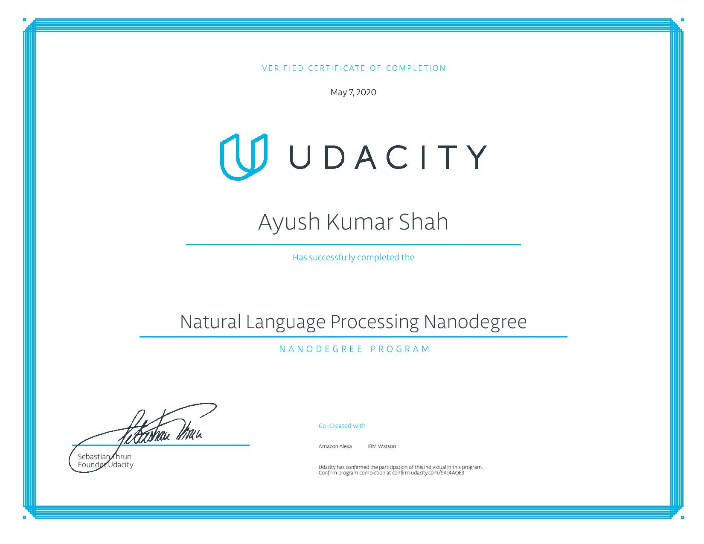

# Natural-Language-Processing-NanoDegree-Udacity

This repository contains the course materials and projects that I submitted during the completion of the [Natural Language Processing Nano Degree](https://www.udacity.com/course/natural-language-processing-nanodegree--nd892)
provided by [Udacity](https://www.udacity.com/).

## Projects

- [Project 1: Parts of Speech Tagger using Hidden Markov Models](https://github.com/ayushkumarshah/Natural-Language-Processing-NanoDegree-Udacity/tree/master/Projects/P1_hmm-tagger)
- [Project 2: Machine Translation](https://github.com/ayushkumarshah/Natural-Language-Processing-NanoDegree-Udacity/tree/master/Projects/P2_machine_translation)
- [Project 3: DNN Speech Recognizer](https://github.com/ayushkumarshah/Natural-Language-Processing-NanoDegree-Udacity/tree/master/Projects/P3_dnn_speech_recognizer)

## Certificate

